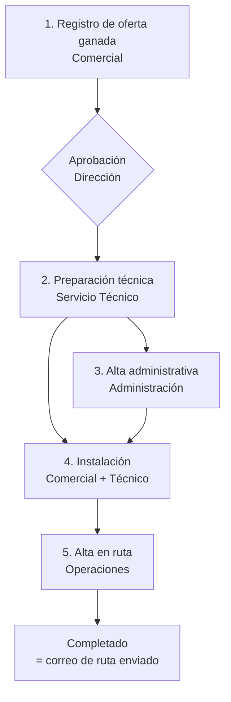

# Diseño funcional — v1 (MVP) · DIGIVEND

Basado en el cuestionario respondido (`01-cuestionario-descubrimiento.md`) y las
decisiones D1–D24 (`02-decisiones.md`).

## 1. Objetivo

Aplicación web SaaS multi-tenant (D1) para operadores de vending que orquesta
los procesos operativos alrededor de las máquinas de un cliente: **instalación**
(de oferta ganada a máquina en ruta) y, también en v1, **retirada, sustitución,
cambio de planograma y subida de precios** (D22).

La app **no crea ofertas** (D13), **no calcula ni liquida el canon** (D11) y
**no se integra** con telemetría, ERP ni sistemas de pago en v1 (D3): coordina a
los departamentos mediante expedientes, tareas y correos con plantillas y
direcciones configurables. Las rutas viven en VendCloud (D23) y la facturación
en el ERP del operador: la app **informa**, no los sustituye.

Interfaz en **español, inglés, italiano y francés**; correos y PDF en el idioma
del operador (D7). Moneda EUR, formatos por región. Mercado inicial: España.

## 2. Roles

| Rol | Qué hace en la app |
|---|---|
| Administrador del tenant | Usuarios, direcciones de correo, plantillas, catálogo de modelos, idioma. |
| Dirección | Aprueba expedientes según el flujo de aprobación (alcance por concretar, D17). |
| Comercial | Registra la oferta ganada, rellena los datos de la instalación (fecha, contacto, requisitos de la ubicación). |
| Servicio Técnico | Prepara máquinas y planogramas, solicita disponibilidad a proveedores, propone modelos alternativos, pide el cambio. |
| Administración | Da de alta el cliente en su ERP (fuera de la app), registra canon y condiciones a facturar, confirma el cambio. |
| Operaciones / Supervisor | Envía el alta en ruta, rellena el ERP y completa la tarea de verificación. |

Un usuario puede tener varios roles (D17). El instalador puede ser interno o
externo, pero **no entra en la app**: recibe correos. Los reponedores y técnicos
de campo **no usan la app** ni reciben información directa (D17).

## 3. Workflow de instalación (flujo fijo, D6)

Cada expediente tiene estado global, tareas con responsable (rol), estado y
fecha límite, **recordatorios por correo** (D23) y **auditoría completa** de
quién hizo qué y cuándo (D23). Un **panel de control** muestra los expedientes
en curso, su fase y los cuellos de botella.

### Paso 1 — Registro de oferta ganada (Comercial)

- Cliente: nombre, dirección de instalación, contacto, tipo de oferta
  **pública o privada** (solo datos económicos, D14).
- Datos de la futura instalación (los rellena el comercial): fecha prevista,
  contacto en el cliente, requisitos de la ubicación (toma de agua, corriente,
  accesos).
- Máquinas previstas: modelo del catálogo, tipo (café vending, café sobremesa,
  snack, mixta), **nueva o usada**, periféricos: monedero, lector de tarjeta,
  billetero, tarjeta privada/llave, app de pago, telemetría (sí/no + proveedor)
  — todo como datos, sin integración (D3).
- **Tarifas**: import del Excel de plantilla propia (D8) o edición manual.
  Soporta franjas horarias y colectivos, vigencias e histórico, y revisión por
  IPC con redondeo a 0,05 € para efectivo (D20).
- **Condiciones especiales** (solo documentación, D10): café gratuito facturado
  al cliente, combos, gratuidades por usuario/día, día de café gratis anual,
  lotes de Navidad y tipo **"otro"** con descripción libre.
- **Canon** (D11): sin canon / fijo / variable / mixto — dato informativo para
  administración.
- Al confirmar, pasa por la **aprobación de Dirección** (D17, alcance por
  concretar) y se generan las tareas de los pasos siguientes.

### Paso 2 — Preparación técnica (Servicio Técnico)

El servicio técnico recibe el **correo de preparación** (q36): qué máquinas
preparar con tipo de monedero, lector de pago, billetero y telemetría.

Por cada máquina:

- **Nueva** → correo de **solicitud de disponibilidad al proveedor** (no pedido
  formal), con **seguimiento de la fecha de entrega** hasta registrar la
  recepción y el nº de serie (D18).
- **Usada** → **petición al servicio técnico**, que confirma disponibilidad o
  **propone un modelo alternativo** (D18); registra nº de serie/matrícula,
  nº de monedero y **contador de servicios** (D21).
- **Periféricos nuevos** (monederos, lectores, billeteros, telemetría) →
  solicitud a su proveedor, también con seguimiento (D18).
- **Planograma** (módulo licenciable aparte, D19): editor visual con rejilla
  bandejas × espirales según el modelo; espirales simple/doble/triple;
  productos y precios de la tarifa por posición; selecciones de café con
  precio/receta. **Plantillas reutilizables** por modelo y tipo de cliente
  (oficina, hospital, fábrica…). Reglas de creación por definir con el cliente.
- **Máquina nueva** → correo al fabricante con el **planograma de fábrica**
  (solo tipos de espirales y huecos, D19).
- **Hoja de preparación de taller (PDF)**: bandejas y espirales a montar o
  cambiar respecto a fábrica, productos y precios por posición, selecciones,
  periféricos a instalar y condiciones especiales a programar y probar (D10).
- **Petición de cambio**: importe y desglose de monedas por monedero → correo a
  administración.

### Paso 3 — Alta administrativa (Administración)

- Recibe ficha del cliente, condiciones de canon, tarifas y condiciones
  especiales a facturar (todo informativo, D11); da de alta el cliente en su
  ERP fuera de la app y lo confirma con su tarea.
- Confirma la preparación del cambio.

### Paso 4 — Instalación

- Correo de **orden de instalación** al instalador (interno o externo) con
  fecha/hora, dirección, contacto, requisitos de la ubicación, lista de
  máquinas (modelo, nº de serie) y adjuntos (hoja de taller / planograma PDF).
- El checklist de instalación con fotos podrá venir de la app existente
  **"Visita Comercial"** (datos en Firebase): integración a valorar (D24).
- El técnico marca la instalación como realizada.

### Paso 5 — Alta en ruta (Operaciones)

- Formulario con **ruta, reponedor y técnico como texto libre** (D12; las rutas
  se gestionan en VendCloud, D23) → **correo de alta en ruta**.
- Correo al **supervisor** para que rellene el ERP, con **tarea de
  verificación** en la app (D23).
- El envío del correo de ruta **cierra el expediente** (D23).

## 4. Otros workflows de v1 (D22)

Mismos mecanismos (expediente, tareas, correos, auditoría) con menos pasos:

| Workflow | Pasos principales |
|---|---|
| **Retirada** | Solicitud (comercial/administración) → orden de retirada al instalador → confirmación → aviso a administración y baja en ruta (correo). |
| **Sustitución** | Selección de máquina a sustituir → preparación técnica de la nueva (como instalación) → orden de sustitución → alta/baja en ruta. |
| **Cambio de planograma** | Nuevo planograma sobre el actual → hoja de cambio para el taller/ruta → confirmación. |
| **Subida de precios** | Nueva vigencia de tarifa (fijo o % IPC, redondeo 0,05 €, D20) → hoja de cambio de precios por máquina → confirmación y aviso a administración. |

## 5. Modelo de datos (entidades principales)

- **Operador (tenant)**: idioma, direcciones de correo por tipo (para/CC,
  varios destinatarios, D23/q37), plantillas, logo, licencia del módulo
  planograma (D19).
- **Usuario** (n roles, credenciales propias, D24).
- **Fabricante** / **ModeloMáquina** (bandejas, espirales por bandeja,
  selecciones, tipo). Catálogo inicial importado del listado del cliente (D9).
- **Cliente** / **Expediente** (tipo: instalación, retirada, sustitución,
  cambio planograma, subida precios; estado; tareas; canon; condiciones
  especiales; aprobación).
- **Máquina**: modelo, nueva/usada, nº serie/matrícula, nº monedero, contador
  de servicios, periféricos (monedero, lector, billetero, app), telemetría,
  planograma.
- **SolicitudProveedor**: máquina o periférico, proveedor, fecha solicitud,
  fecha entrega prevista, estado (seguimiento, D18).
- **Producto** / **SelecciónCafé** / **Tarifa** (líneas con precio, franja
  horaria, colectivo; vigencias; revisión IPC) / **CondiciónEspecial** (tipo
  incl. "otro", descripción, valor).
- **Planograma** → **Posición** (bandeja, espiral, tipo simple/doble/triple,
  producto, capacidad, precio) · **PlantillaPlanograma** (por modelo y tipo de
  cliente).
- **CorreoEnviado** (tipo, destinatarios, cuerpo, adjuntos, fecha, expediente).
- **Tarea** / **EventoAuditoría**.

## 6. Correos de v1 (D3, D7, D18, D23)

Todos con plantilla editable por idioma (variables `{{cliente}}`, `{{modelo}}`,
`{{fecha}}`…) y direcciones configurables por tipo con varios destinatarios y
CC. Basta con enviar (sin acuse, q39); cada envío queda archivado en el
expediente.

1. **Preparación técnica** al servicio técnico (máquinas + periféricos a preparar).
2. **Solicitud de disponibilidad** a proveedor (máquinas y periféricos nuevos).
3. **Planograma de fábrica** al fabricante (máquinas nuevas).
4. **Petición de cambio** a administración.
5. **Orden de instalación / retirada / sustitución** al instalador.
6. **Alta/baja en ruta** + aviso al supervisor para rellenar el ERP.

## 7. Plantilla Excel de tarifas (D8, D20)

Descargable desde la app, hojas: **Productos** (código, nombre, categoría,
precio, franja/colectivo opcional), **Selecciones de café** (nº, nombre, precio;
0 € = gratuito con precio facturado al cliente), **Combos** (composición, precio
especial), **Condiciones especiales** (tipo incl. "otro", descripción, valor).
Validación fila a fila antes de confirmar. El mismo mecanismo de import se usa
para la **migración inicial** de clientes y máquinas desde Excel (D24).

## 8. Requisitos no funcionales

- **Multi-tenant** con aislamiento estricto por operador; módulo de planograma
  activable por licencia (D19).
- **Web responsive/PWA** (D4); usuarios de oficina y taller.
- i18n ES/EN/IT/FR desde el primer día; EUR; formatos de fecha/número por región.
- Dimensionado para el piloto: ~4.000 máquinas, ~5 instalaciones/mes,
  ~120 usuarios por tenant (D15).
- Autenticación propia usuario/contraseña (D24); RGPD, alojamiento UE.
- Plataforma de hosting: **Firebase vs AWS pendiente de la propuesta técnica**
  (D24); la integración con "Visita Comercial" (Firebase) pesa a favor de
  Firebase.

## 9. Fuera de alcance v1 (→ v2)

Creación de ofertas/CRM y cálculo de rentabilidad (otra app, D13) · cálculo y
liquidación de canon (D11) · facturación · integraciones de telemetría
(Televend, CAS Lab, Frekuent), ERP y sistemas de pago (D3) · control real de
gratuidades y combos (D10) · maestro de rutas (VendCloud, D23) · workflow
configurable (D6) · optimización de planogramas según ventas/reposiciones
(D19) · vista de calendario · app nativa.
