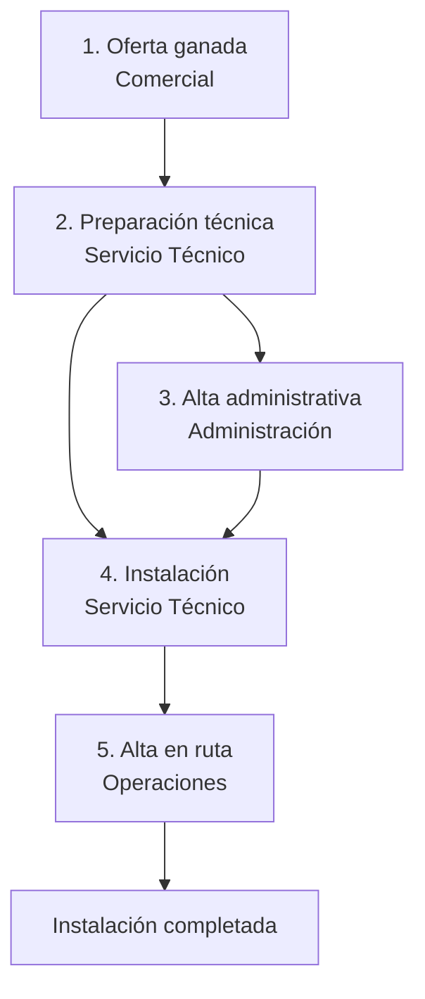

# Diseño funcional — v1 (MVP)

Basado en el cuestionario (`01-cuestionario-descubrimiento.md`) y las decisiones
D1–D16 (`02-decisiones.md`).

## 1. Objetivo

Aplicación web SaaS multi-tenant (D1, D4) para operadores de vending medianos
(D15) que orquesta **todo el proceso de instalación de un cliente nuevo**, desde
el registro de la oferta ganada hasta el alta de las máquinas en ruta. La app
**no crea ofertas** (D13), **no calcula el canon** (D11) y **no se integra** con
telemetría, ERP ni sistemas de pago en v1 (D3): coordina a los departamentos
mediante tareas y correos con plantillas configurables.

Interfaz en **español, inglés, italiano y francés**; correos y PDF en el idioma
configurado por el operador (D7).

## 2. Roles

| Rol | Qué hace en la app |
|---|---|
| Administrador del tenant | Configura empresa: usuarios, direcciones de correo, plantillas, catálogo de modelos, idioma. |
| Comercial | Registra la oferta ganada y lanza el workflow. |
| Servicio Técnico | Prepara máquinas y planogramas, pide máquinas nuevas y cambio. |
| Administración | Da de alta el cliente, registra el canon, confirma el cambio. |
| Operaciones / Jefe de ruta | Envía el alta en ruta con reponedor y técnico. |

Un usuario puede tener varios roles. Instaladores y proveedores **no** entran en
la app: solo reciben correos.

## 3. Workflow de instalación (flujo fijo, D6)

Cada expediente de instalación tiene un estado global y una lista de tareas con
responsable (rol), estado (*pendiente / en curso / hecha*) y fecha. El panel de
inicio muestra a cada rol sus tareas pendientes.

### Paso 1 — Registro de oferta ganada (Comercial)

- Datos del cliente: nombre, dirección de instalación, contacto, idioma no
  aplica (D7), tipo de oferta **pública o privada** (solo datos económicos, D14).
- Máquinas previstas: por cada una, modelo (del catálogo), tipo (café vending,
  café sobremesa, snack, mixta), **nueva o usada**, sistemas de pago previstos
  (monedero, tarjeta bancaria, tarjeta privada/llave, app) y telemetría sí/no
  con proveedor — todo como datos, sin integración (D3).
- **Tarifas**: importación del Excel de plantilla propia (D8) o edición manual.
- **Condiciones especiales** (solo documentación, D10): café gratuito facturado
  al cliente, combos, gratuidades por usuario/día, día de café gratis al año,
  lotes de Navidad, otras (campo libre estructurado: tipo + descripción +
  condición económica).
- **Canon** (D11): sin canon / fijo (importe + periodicidad) / variable (% y
  base) / mixto. Solo se registra para informar a administración.
- Al confirmar: se crea el expediente y se generan las tareas del paso 2 y la
  tarea de administración.

### Paso 2 — Preparación técnica (Servicio Técnico)

Por cada máquina del expediente:

- **Máquina nueva** → botón "Pedir al proveedor": genera el **correo al
  proveedor** (plantilla + dirección configurables) con modelo y datos de
  entrega; la tarea queda "esperando recepción" hasta que el técnico registra
  la llegada y el nº de serie.
- **Máquina usada** → el técnico registra **nº de serie/matrícula** y **nº de
  monedero**.
- **Planograma** (D5): editor visual con rejilla bandejas × espirales según el
  modelo; se asignan productos (con su precio de la tarifa) por espiral y las
  selecciones de café con su precio/receta. Se pueden guardar y reutilizar
  **plantillas de planograma** por modelo.
- **Hoja de preparación de taller (PDF)**: por máquina — bandejas y espirales a
  montar/cambiar, productos por posición, precios, selecciones de café,
  sistemas de pago a instalar y condiciones especiales a programar (D10).
- **Petición de cambio**: formulario (importe y desglose de monedas por
  monedero) que genera el **correo a administración**.

### Paso 3 — Alta administrativa (Administración)

- Completa la ficha del cliente con los datos fiscales y lo marca como dado de
  alta (el alta real en su ERP se hace fuera de la app en v1).
- Revisa las condiciones de canon y condiciones especiales a facturar
  (solo informativo, D11).
- Confirma la preparación del cambio solicitado.

### Paso 4 — Instalación

- El técnico planifica fecha y genera el **correo al instalador**: dirección,
  contacto en el cliente, fecha/hora, lista de máquinas (modelo, nº de serie)
  y observaciones. Marca la instalación como realizada.

### Paso 5 — Alta en ruta (Operaciones)

- Formulario con **ruta, reponedor y técnico asignados como texto libre** (D12)
  que genera el **correo de alta en ruta** a la dirección configurada.
- Al enviarse, el expediente pasa a **Completado**.

Todos los pasos quedan en un **registro de auditoría** (quién, qué, cuándo).

## 4. Modelo de datos (entidades principales)

- **Operador (tenant)** → configuración: idioma, direcciones de correo por tipo,
  plantillas de correo, logo.
- **Usuario** (n roles).
- **Fabricante** y **ModeloMáquina**: nº de bandejas, espirales por bandeja,
  nº de selecciones de café, tipo. Catálogo inicial: Sanden Vendo, Rhea,
  Bianchi, Evoca/Necta, Azkoyen, Jofemar (D9, pendiente listado del cliente);
  el operador puede crear modelos propios.
- **Cliente** y **Expediente de instalación** (la "oferta ganada"): estado,
  tareas, canon, condiciones especiales.
- **Máquina**: modelo, nueva/usada, nº serie, nº monedero, sistemas de pago,
  telemetría (sí/no + proveedor), planograma.
- **Producto** y **SelecciónCafé**; **Tarifa** = líneas producto/selección +
  precio, con combos y gratuidades como **CondiciónEspecial** (tipo, descripción,
  valor).
- **Planograma** → **Posición** (bandeja, espiral, tipo de espiral, producto,
  capacidad, precio); **PlantillaPlanograma** por modelo.
- **Correo enviado**: tipo, destinatarios, cuerpo, fecha, expediente (trazabilidad).
- **Tarea** y **EventoAuditoría**.

## 5. Correos (D3, D7)

Cuatro tipos en v1, cada uno con **plantilla editable** (variables tipo
`{{cliente}}`, `{{modelo}}`, `{{fecha}}`) y **direcciones configurables**
(para/CC, por tipo de correo) en la configuración del tenant:

1. **Pedido a proveedor** (máquinas nuevas).
2. **Petición de cambio** a administración.
3. **Orden de instalación** al instalador (adjunta hoja de taller/planograma PDF).
4. **Alta en ruta** (ruta, reponedor, técnico).

Envío vía SMTP/Microsoft 365/Google Workspace configurado por el operador;
la app guarda copia de cada correo enviado en el expediente.

## 6. Plantilla Excel de tarifas (D8)

Descargable desde la app, con hojas:

1. **Productos**: código, nombre, categoría, precio.
2. **Selecciones de café**: nº selección, nombre, precio (0 € = gratuito
   facturado al cliente, con campo de precio facturado).
3. **Combos**: productos que lo forman, precio especial.
4. **Condiciones especiales**: tipo (gratuidad diaria, día gratis anual, lote
   Navidad, otra), descripción, valor.

La importación valida formato y datos (precios, duplicados, referencias) y
muestra los errores fila a fila antes de confirmar.

## 7. Requisitos no funcionales

- **Multi-tenant** con aislamiento estricto de datos por operador.
- **PWA responsive**: uso completo desde móvil (técnicos en taller).
- i18n de interfaz ES/EN/IT/FR desde el primer día; textos externalizados.
- Auditoría completa por expediente (útil en licitaciones, D14).
- Dimensionado para 500–5.000 máquinas y decenas de instalaciones/mes por
  tenant (D15).
- Alojamiento en nube UE (RGPD).

## 8. Fuera de alcance v1 (→ v2)

Creación de ofertas/CRM (D13) · cálculo y liquidación de canon (D11) ·
facturación · integraciones de telemetría, ERP y pagos (D3) · control real de
gratuidades y combos (D10) · maestro de rutas (D12) · workflow configurable
(D6) · retiradas y sustituciones de máquinas · app nativa.
